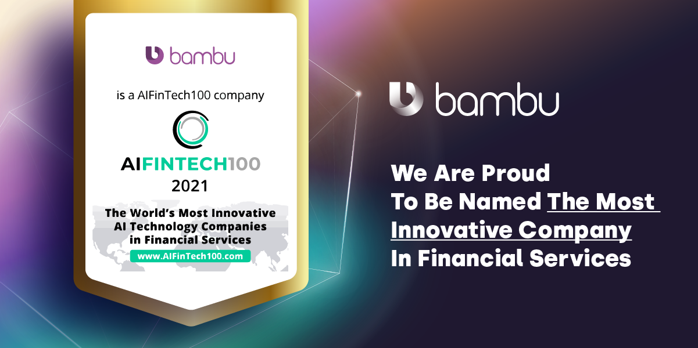

# Bambu: robo-advising platform

## **Overview**
> "At the core of Bambu, we empower our clients to help their users save and invest digitally." - Bambu.com

Bambu is a company founded in 2016 by Ned Phillips and Aki Ranin. Bambu is a fintech company that develops technology for wealth management. For example, robo advisory, API (application programing interfaace) platform. The company is B2B. Bambbus has won many awards such as being named as AIFinTech100 comapny and The World's Most Innovative AI Technology Services. As well as alumni of SuperCharger 2.0 Accelerator program and finalist at Jumpstart organised by Alibaba Entrepreneurs Fund.

 

 

### *How did the idea come about ?*
Ned was inspired by his experience working in a Business to Customer (B2C) fintech company. Ned had noticed that the banks was always asking whether the company's software can be sold. Inspired by the demand, Ned nad Aki had started their business which provides robo based wealth management product. 

### *How is the company funded ?*
Bambu has received 4 funding rounds. Bambu has raised $13.4 M in total. Bambu has been funded by leading investors such as Franklin Templeton Investments and Peak 6. The lastest funding was a Series B and it was raised on 15 Mar, 2021. 

 

## **Business activities**

### *What problem does Bambu deals with ?*
Bambu develops technology for financial institution whose customers wants to invest online and a personalised digital experience. Bambu helps financial institution intergrate their system with new technologies. Bambu provides AI robo advisor that engages and provides a personalised investment plans with customers.

Bambu has 3 product lines which are:
- Bambu API
- Bambu BUILD
- Bambu GO  

### *Who is Bambu targeting at?*
Bambu targets at financial institution. Examples of Bambu's clients are asset managers, bank wealth managers, brokers etc. According to AWS Startup Blog, the founders has strategically targets institutional clients because it can be very difficult to get robo-advisory liscence in some country. Therefore, by working with clients who already has liscensing makes Bambu grow easier. 

### *What is the competitive advantage of Bambu ?*

 

#### Liscensing:
Bambu works with institutional clients who already has the liscence to do investment advisory in various country. This eases their regulatory difficulties. 

#### Easy to work with for non-programming backgorund users 
....

## Landscape

* What domain of the financial industry is the company in?

* What have been the major trends and innovations of this domain over the last 5–10 years?

* What are the other major companies in this domain?

## Results

* What has been the business impact of this company so far?

* What are some of the core metrics that companies in this domain use to measure success? How is your company performing, based on these metrics?

* How is your company performing relative to competitors in the same domain?

## Recommendations

* If you were to advise the company, what products or services would you suggest they offer? (This could be something that a competitor offers, or use your imagination!)

* Why do you think that offering this product or service would benefit the company?

* What technologies would this additional product or service utilise?

* Why are these technologies appropriate for your solution?

  

## **Appendix**: 

## **Reference**:

https://bambu.co/company/about-us/

https://www.linkedin.com/company/bambu-roboadvisory/

https://www.plugandplaytechcenter.com/resources/6-startups-will-shape-future-wealth-management/

https://youtu.be/f3qdt0IiNpY

https://aws.amazon.com/blogs/startups/robo-advising-financial-planning/

